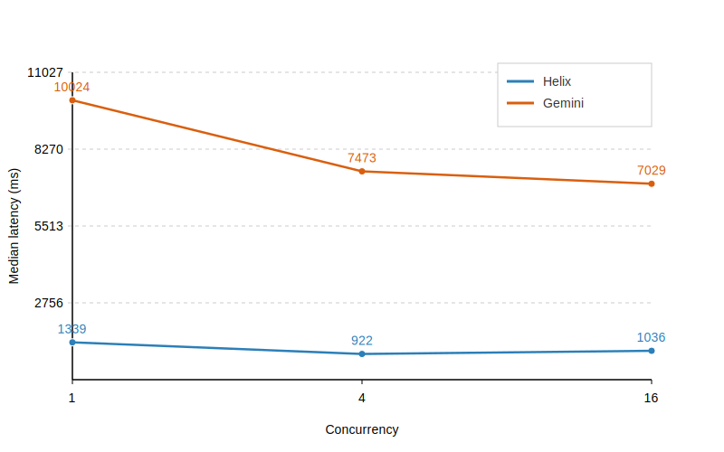

# Benchmark: Helix-DB vs Gemini File Search

This repo provides a reproducible harness that ingests the same corpus into Helix-DB and Gemini File Search, then runs identical query loads to compare ingest speed, latency, and concurrency scaling.

## Prerequisites

- Python 3.11+
- [uv](https://github.com/astral-sh/uv) for dependency management (`pip install uv` if needed)
- Helix-DB CLI installed locally (`helix init && helix dev up`)
- Environment variables:
  - `OPENAI_API_KEY` for embeddings
  - `GEMINI_API_KEY` for File Search
  - `HELIX_API_KEY` if your Helix instance requires auth

Install dependencies (creates a virtual env managed by uv):

```bash
uv sync
```

Run scripts via uv to reuse the managed environment, e.g. `uv run python scripts/prepare_dataset.py`.

## Repository layout

```
benchmark-helix-vs-gemini/
  config/config.toml        # global settings for paths, concurrency, API endpoints
  data/raw/                 # drop your .md/.txt corpus here
  data/chunks/dataset.jsonl # produced chunks
  data/queries.json         # workload definitions
  helix/schema.hx           # DocumentChunk schema
  helix/queries.hx          # insert + vector search queries
  scripts/                  # orchestration scripts
  results/                  # CSV outputs
```

## Workflow

1. **Prepare dataset** – normalize and chunk the raw corpus.
   ```bash
   uv run python scripts/prepare_dataset.py
   ```
2. **Ingest Helix** – embed chunks and batch insert into the local Helix dev instance.
   ```bash
   uv run python scripts/ingest_helix.py
   ```
3. **Ingest Gemini** – upload the same raw files to a Gemini File Search store (Gemini File Search).
   ```bash
   uv run python scripts/ingest_gemini.py
   ```
4. **Run benchmarks** – execute the configured query suites across concurrency levels.
   ```bash
   uv run python scripts/run_benchmarks.py
   ```

Each script validates required inputs and fails fast with clear error messages if prerequisites are missing.

## Configuration

`config/config.toml` centralizes file paths, embedding model names, API hosts, batch sizes, and benchmark settings. Update it to match your environment (ports, corpus IDs, concurrency list, etc.).

Key knobs:

- `[data]` – where to read raw docs, chunks, and queries.
- `[embeddings]` – OpenAI embedding model + batch size.
- `[helix]` – Helix base URL plus query names compiled from `helix/queries.hx`.
- `[gemini]` – Gemini File Search store identifier (set `store_name` after running `ingest_gemini.py`) and model details.
- `[benchmark]` – concurrency levels, attempts, output folder, and top-k retrieval depth.

## Outputs

`run_benchmarks.py` writes `results/helix_results.csv` and `results/gemini_results.csv` (system, query_id, concurrency, attempt, latency, timestamp) and logs p50/p95/p99 + QPS per concurrency level. Run `python scripts/plot_results.py` to turn those CSVs into an SVG plot:



## Extending / Deploying

- When moving Helix-DB to EC2, adjust `helix.base_url` (e.g., `http://52.55.138.22:7070`) and `HELIX_API_KEY`.
- Gemini ingestion logs the File Search store ID (e.g., `fileStores/123`) so you can reuse it by setting `gemini.store_name`.
- All HTTP clients are plain `httpx`, making it easy to swap API hosts or plug in mock servers for CI.

### EC2 Setup Reference

For the remote Helix numbers shown above, Helix ran on an **Amazon Linux** instance upgraded to **Ubuntu 24.04** equivalent, provisioned as `c7i.xlarge` (4 vCPUs, 8 GiB RAM, 100 GB gp3 EBS). Key steps:

1. Install Docker Engine + Buildx/Compose plugins (`docker-ce docker-ce-cli containerd.io docker-buildx-plugin docker-compose-plugin`).
2. Install the Helix CLI via `curl -sSL https://install.helix-db.com | bash`.
3. Clone this repo, run `helix build dev` then `helix start dev`.
4. Open TCP 7070 in the instance security group (or tunnel `ssh -L 7070:localhost:7070`).
5. Run `uv run python scripts/ingest_helix.py` on the instance to load the dataset, then point your laptop’s `config/helix.base_url` at the EC2 public IP when running the benchmarks.

Any c7i/c7g instance with at least 4 vCPUs and 8 GiB RAM will behave similarly; scale up if you expect higher QPS or larger corpora.
